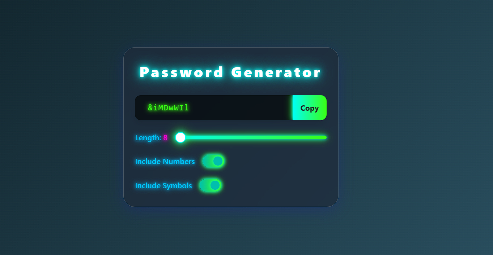

# Futuristic Password Generator 🔐

A modern, futuristic password generator built with React and Vite. Instantly generate strong, customizable passwords with a beautiful glassmorphism and neon-inspired UI.



## ✨ Features

- Instantly generate secure passwords
- Customize password length (8–100)
- Toggle inclusion of numbers and symbols
- Modern, glassmorphism and neon UI
- Responsive and accessible design

## 🚀 Getting Started

### Prerequisites

- Node.js (v14 or newer recommended)
- npm or yarn

### Installation

```bash
npm install
```

### Run the App

```bash
npm run dev
```

Then open [http://localhost:5173](http://localhost:5173) in your browser.

## 📁 Project Structure

- `src/App.jsx` — Main React component
- `src/App.css` — Custom styles for the futuristic UI
- `public/` — Static assets

## 🖼️ Screenshot


## 📝 License

MIT
